# Figma Assets Catalog

Frame previews live in `public/figma-assets/frames/`. Everything else stays in `public/figma-assets/` for now.

---

## Page Design Frames

These are the full Figma page designs used as implementation reference.

### 960px Desktop

| Preview | File | Description |
|---------|------|-------------|
|  | `frame-5--960px_homepage.png` | **Homepage v1** — news cards row, schedule widget sidebar, hero with folk pattern |
|  | `frame-6--960px_homepage.png` | **Homepage v2** — same layout, slight content variation |
|  | `frame-1--960_naujienų_sąrašas.png` | **News list** — grid of news cards with hero images |
|  | `frame-9--960_naujiena_1_var_.png` | **News article v1** — full article with photo on right, sponsors row |
|  | `frame-10--960_naujiena_2_var_.png` | **News article v2** — full article with photo at top |
|  | `frame-11--960_apie_ritinį.png` | **About Ripka** — "Ripka šiandien" section, federation info, folk pattern |
|  | `frame-12--960_komanda.png` | **Team page** — coach section, player grid, team info |
|  | `frame-13--960_komandų_sąrašas.png` | **Teams list** — grid of team cards with school logos |
|  | `frame-14--960_turnyrinė_lentelė.png` | **Tournament table v1** — standings table, "Didysis finalas" section |
|  | `frame-15--960_turnyrinė_lentelė.png` | **Tournament table v2** — standings with team photos |
|  | `frame-8--960_kontaktai.png` | **Contacts** — contact form, Google Maps, sponsor logos grid |

### 640px Tablet

| Preview | File | Description |
|---------|------|-------------|
|  | `frame-16--640px_homepage.png` | **Homepage v1** tablet |
|  | `frame-17--640px_homepage.png` | **Homepage v2** tablet |
|  | `frame-18--640px_naujienų_sąrašas.png` | **News list** tablet |
|  | `frame-19--640px_tvarkaraštis.png` | **Schedule** tablet |
|  | `frame-20--640px_apie_ritinį.png` | **About Ripka** tablet |
|  | `frame-21--640px_naujiena_2_var_.png` | **News article v2** tablet |
|  | `frame-22--640px_naujiena_1_var_.png` | **News article v1** tablet |
|  | `frame-23--640px_kontaktai.png` | **Contacts** tablet |
|  | `frame-24--640px_komanda.png` | **Team page** tablet |

---

## Icons & Patterns

| Preview | File | Description | Use |
|---------|------|-------------|-----|
|  | `frame-2--Instagram_icon.png` | Instagram pixel-art icon | Footer/Navbar social link |
|  | `frame-3--Youtube_icon.png` | YouTube pixel-art icon | Footer/Navbar social link |
|  | `frame-7--Facebook_icon.png` | Facebook pixel-art icon | Footer/Navbar social link |
|  | `frame-4--Raštai_vertikalūs_trumpi.png` | Folk pattern — vertical short strip (green bg, white pixel motif) | Section dividers |

---

## Folk Patterns & Emblems

The saulutė (sun) is the traditional Ripka folk emblem — red rays on dark background.

| Preview | File | Size | Description |
|---------|------|------|-------------|
| 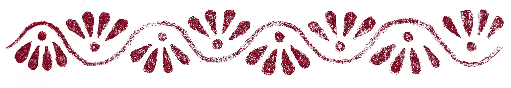 | `fill-33-679df93151a2.png` | 984 KB | **Saulutė emblem** — large clean red sun-burst folk symbol on dark background |
| 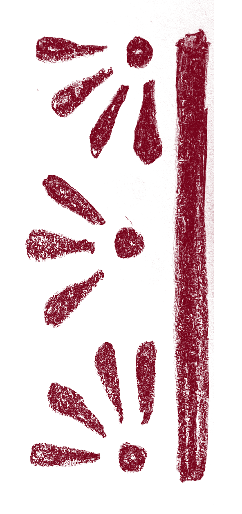 | `fill-23-472d77360e1e.png` | 361 KB | **Saulutė emblem** — medium version, dark red on near-black |
| 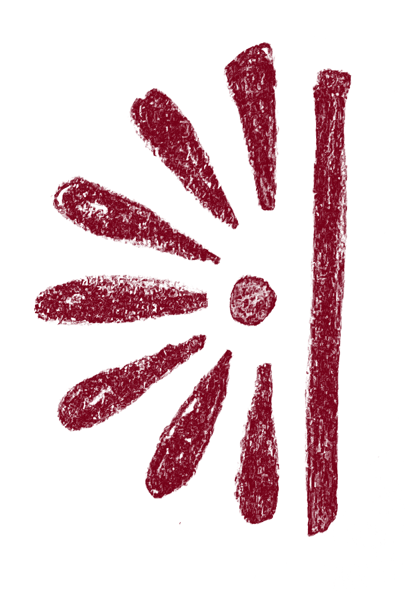 | `fill-16-31bd99b3e201.png` | 270 KB | **Saulutė emblem** — smaller version, same motif |
| 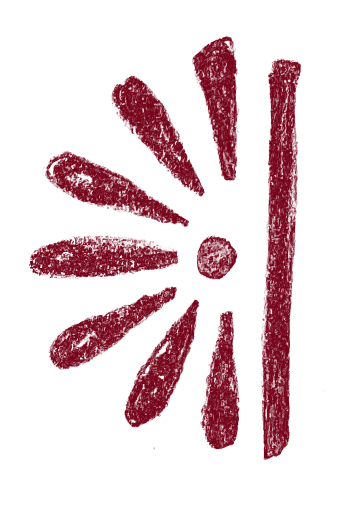 | `fill-26-5254e58c3392.png` | 108 KB | **Saulutė emblem** — compact version |
| 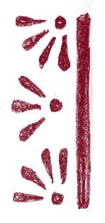 | `fill-67-e1c5a10f26a4.png` | 40 KB | **Saulutė partial** — top portion of sun motif |
|  | `fill-32-6747a89bf74b.png` | 32 KB | **Folk ornament strip** — horizontal red floral/leaf border pattern |

---

## Photographs — Game Action

Sports and action photography from Ripka matches and events.

| Preview | File | Size | Description |
|---------|------|------|-------------|
| 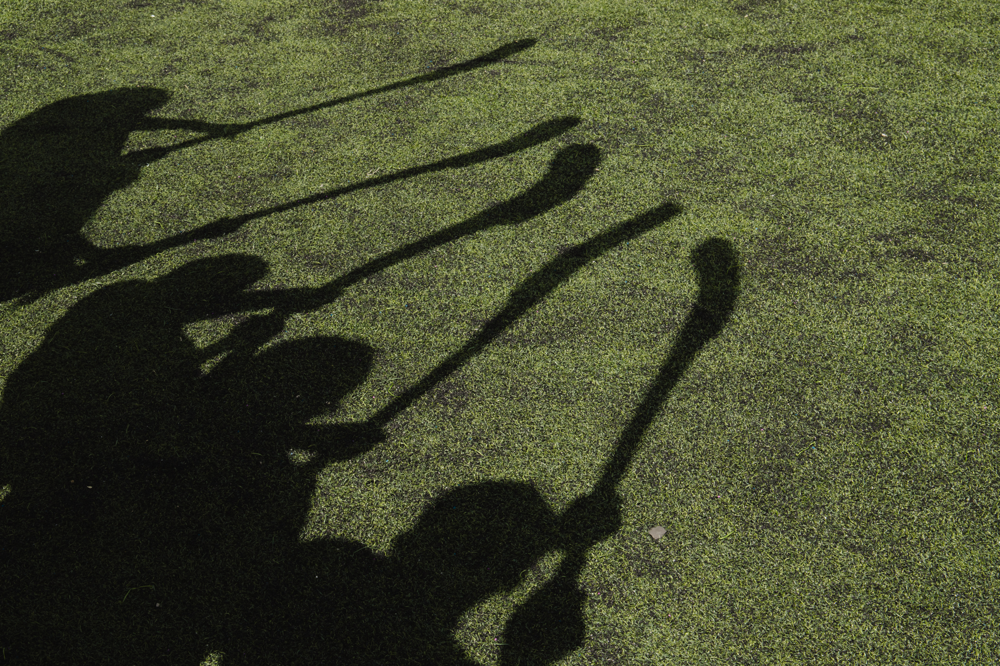 | `fill-6-149c9987ca45.png` | 15.6 MB | **Hero aerial** — bird's-eye view of turf with dramatic player shadows |
| 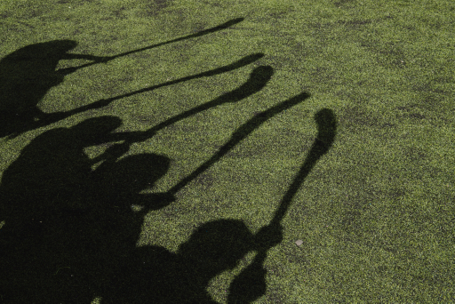 | `fill-1-0493a574f954.png` | 282 KB | **Aerial shadows** — similar top-down shadow silhouettes on turf |
| 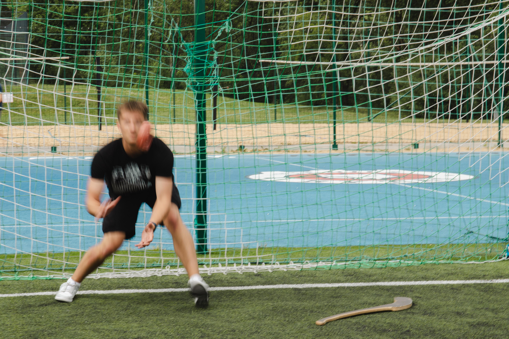 | `fill-37-72c6117f08c0.png` | 11.0 MB | **Player lunging** — player in black shirt reaching for stick, goal net behind |
|  | `fill-18-36ad8b171802.png` | 10.2 MB | **Player reaching** — player in black shirt, motion blur, outdoor court |
| 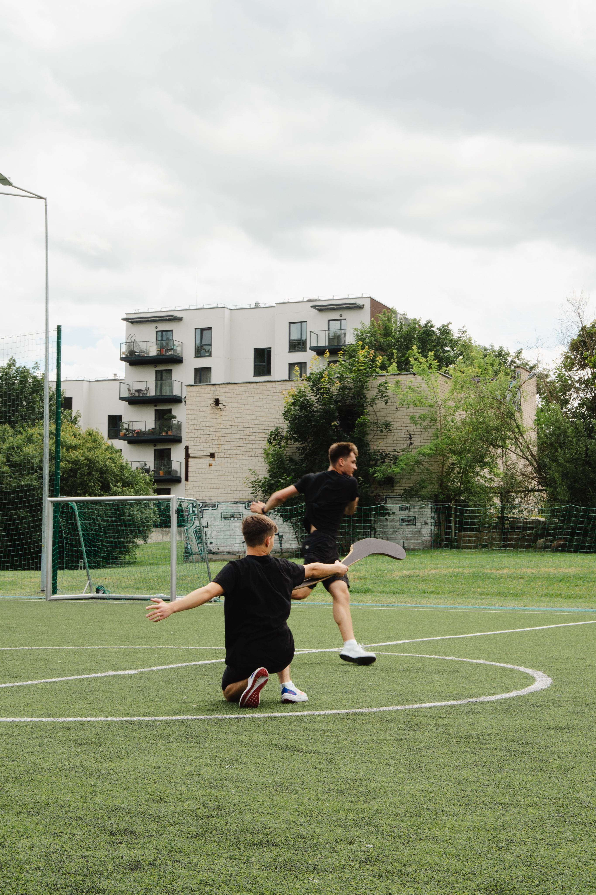 | `fill-80-fce1b546192c.png` | 9.9 MB | **Game play wide** — player with goal in background, daytime |
| 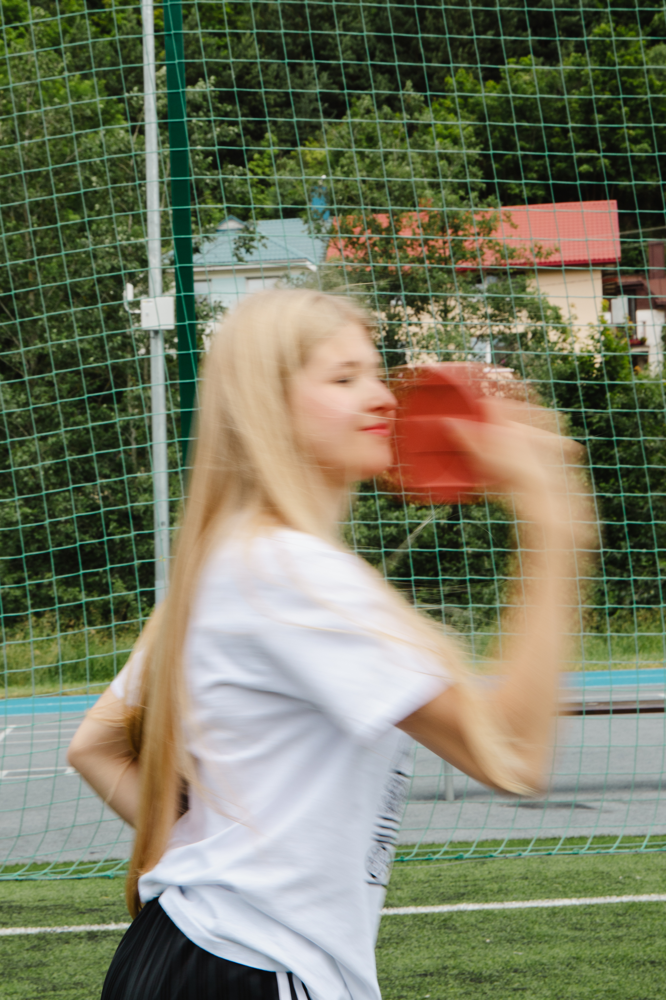 | `fill-20-3a15b0153bfe.png` | 9.0 MB | **Girl playing** — blond girl in white shirt, motion blur, green goal net |
| 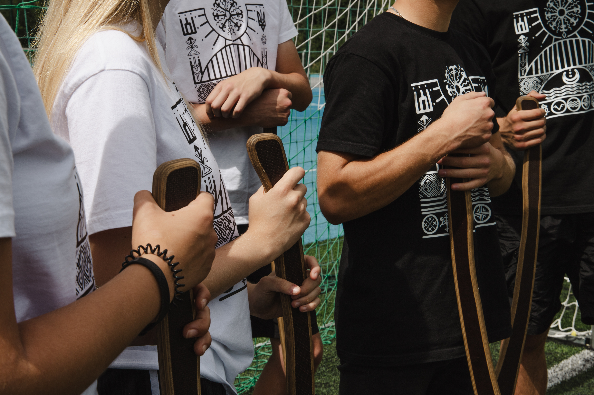 | `fill-57-d2c662caa939.png` | 8.3 MB | **Sticks close-up** — players' midsections holding ripka sticks |
|  | `fill-7-1c34134f94d5.png` | 7.1 MB | **Player jumping** — white shirt, kick/jump motion, field + trees |
| 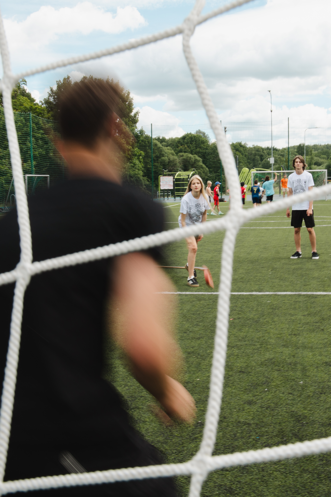 | `fill-70-e7a8a314096c.png` | 7.0 MB | **Goal net bokeh** — goal net foreground blur, players in background |
| 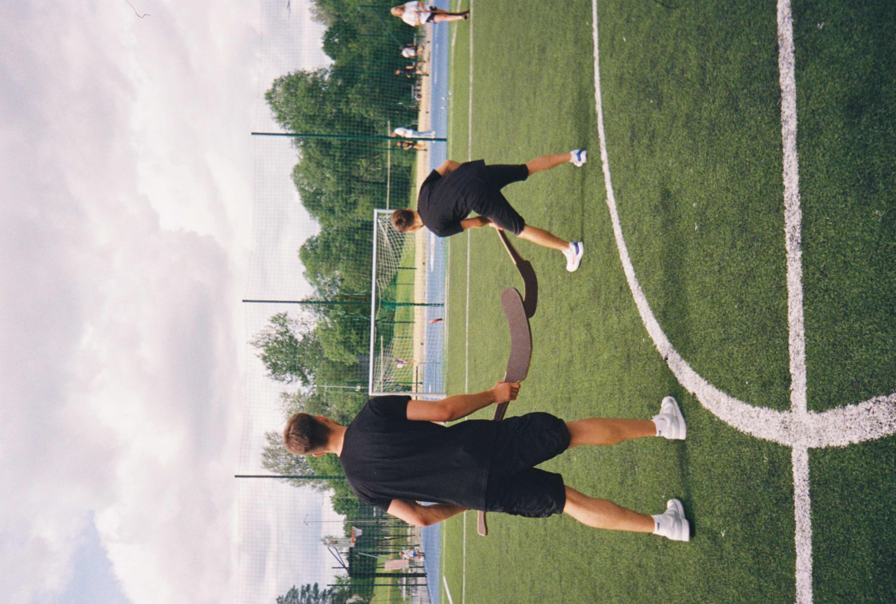 | `fill-52-b71141095a08.png` | 5.1 MB | **Two players** — player reaching toward another on field |
| 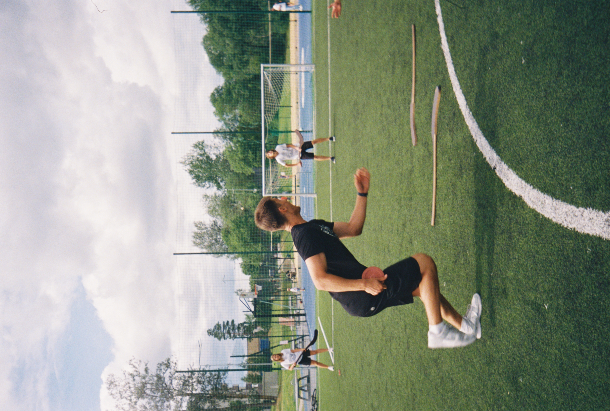 | `fill-62-db09dd29063c.png` | 5.0 MB | **Running player** — player running on field, sticks on ground |
| 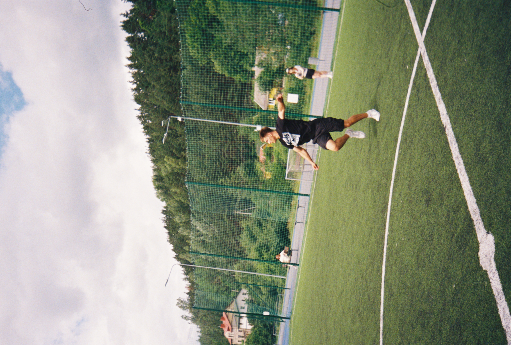 | `fill-74-ef59075024dc.png` | 5.2 MB | **Field play** — action shot on field |
| 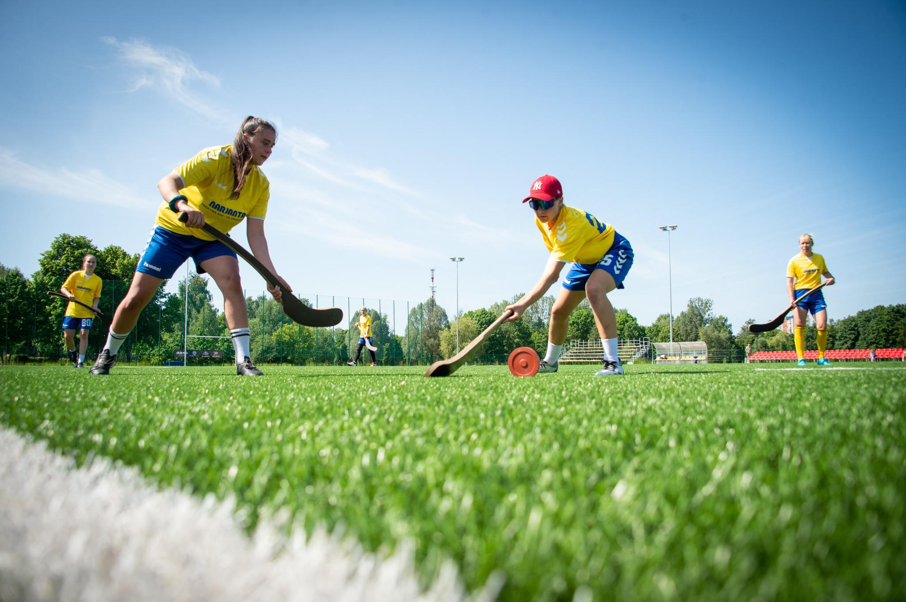 | `fill-75-f048a382005e.png` | 4.6 MB | **Yellow team** — low angle action with team in yellow shirts |
|  | `fill-38-79f7976ee652.png` | 311 KB | **Yellow team wide** — wider angle, same yellow-shirt team on field |
| 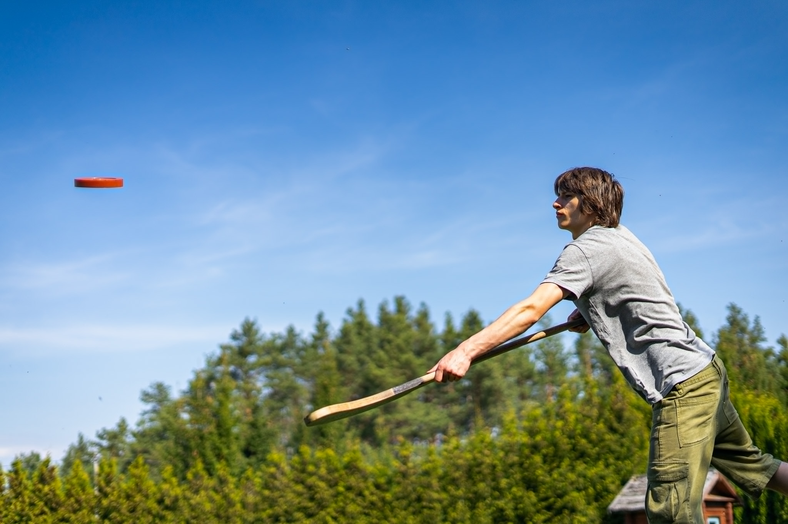 | `fill-27-5552cd511a67.png` | 3.4 MB | **Player swinging** — throwing/swinging with stick, outdoor, trees |
| 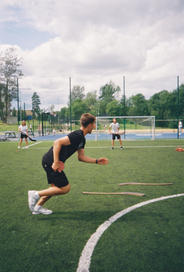 | `fill-63-dd3540b737ea.png` | 198 KB | **Player lunging** — player in black, grass field |
|  | `fill-61-da7d75b9c153.png` | 298 KB | **Player near goal** — jumping/reaching near outdoor goal |
| 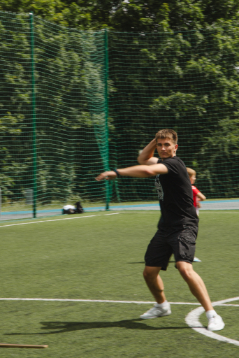 | `fill-71-ee468e6894a8.png` | 247 KB | **Player reaching** — throwing/extending, outdoor court |
|  | `fill-41-8b727b127bc9.png` | 216 KB | **Two players** — one lunging, blue building visible behind |
|  | `fill-58-d2cb135779c7.png` | 259 KB | **Player & disc** — stick in hand, orange disc mid-air |
| 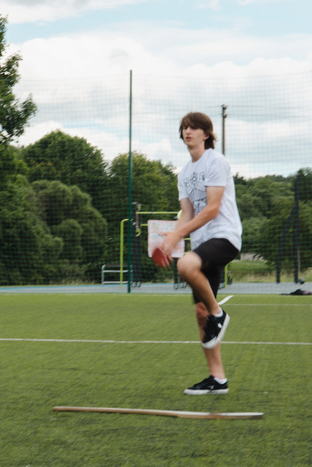 | `fill-17-343f743903e1.png` | 205 KB | **Player kicking** — white shirt, jump/kick on sunny field |
| 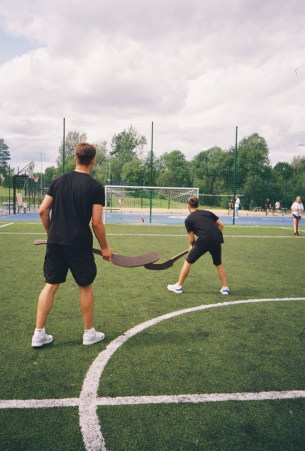 | `fill-45-94fb0ee2f60f.png` | 199 KB | **Two players with sticks** — rear angle, dark shirts on field |
| 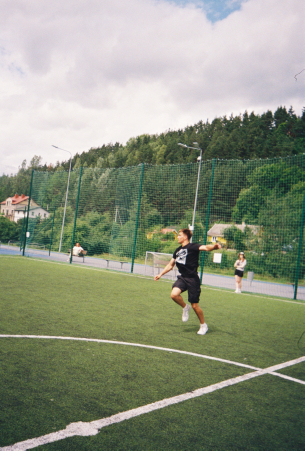 | `fill-3-086aed4f7a54.png` | 207 KB | **Running player** — side view, dark shirt, field |
| 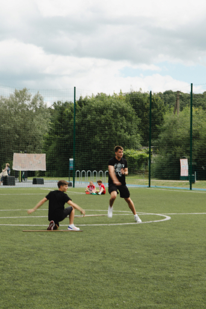 | `fill-79-fcc36a82947d.png` | 214 KB | **Distant game play** — field overview, players at distance |
| 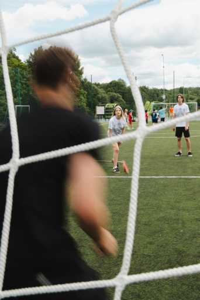 | `fill-39-7dca1c780370.png` | 193 KB | **Goal net foreground** — net close-up, players beyond |

---

## Photographs — Equipment Close-ups

| Preview | File | Size | Description |
|---------|------|------|-------------|
| 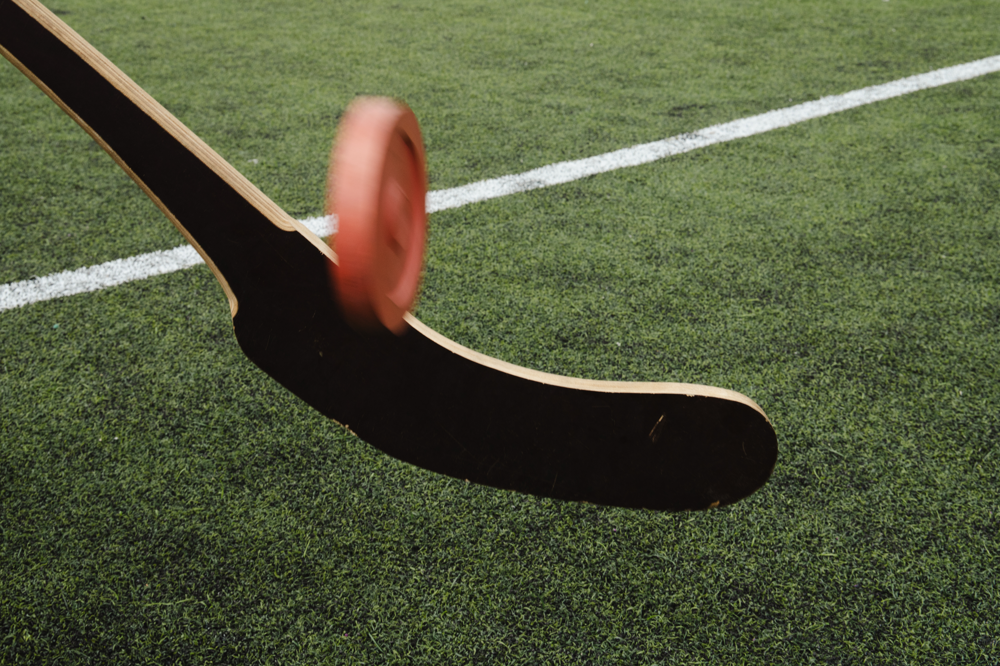 | `fill-64-ddc0a7c6718c.png` | 10.9 MB | **Stick & disc** — ripka stick and orange disc on turf, diagonal close-up |
|  | `fill-34-6d80671f59da.png` | 12.5 MB | **Stick in hands** — player's feet/legs holding stick on grass, orange disc |
| 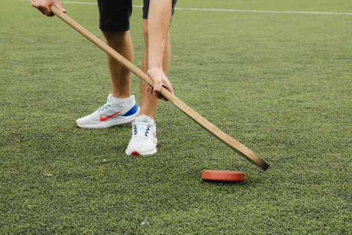 | `fill-77-f5348196f6a8.png` | 279 KB | **Stick close-up** — legs/feet, stick near turf |
| 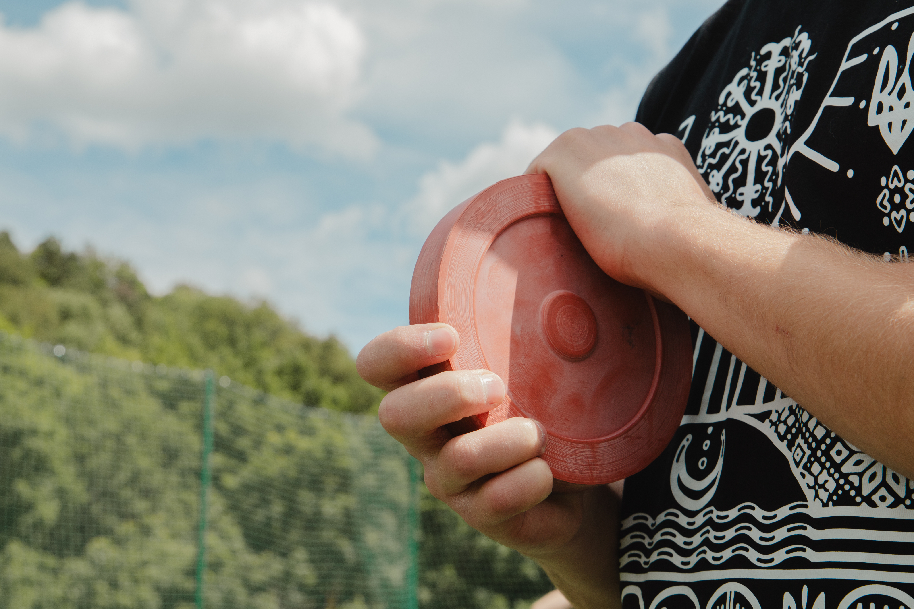 | `fill-2-06a6a7f592b7.png` | 7.7 MB | **Ball in hands** — close-up holding ripka ball, folk-pattern shirt visible |
| 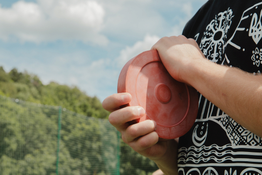 | `fill-31-66e726af83f4.png` | 198 KB | **Ball in hands** — smaller version, similar close-up |
|  | `fill-22-459c8f893a86.png` | 265 KB | **Stick & disc on turf** — top-down view of stick and disc on grass |

---

## Photographs — Team & People

| Preview | File | Size | Description |
|---------|------|------|-------------|
| 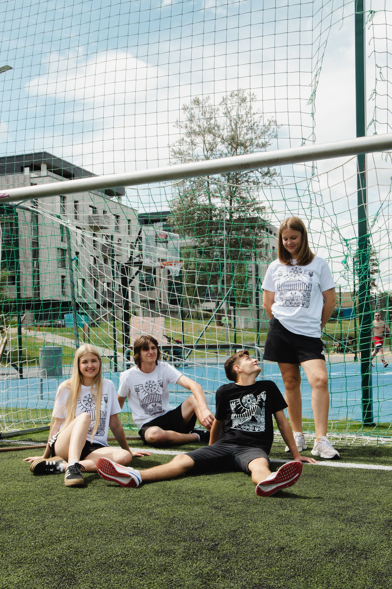 | `fill-36-725adf135808.png` | 12.9 MB | **Team photo large** — group of 3-4 in white shirts in front of goal |
| 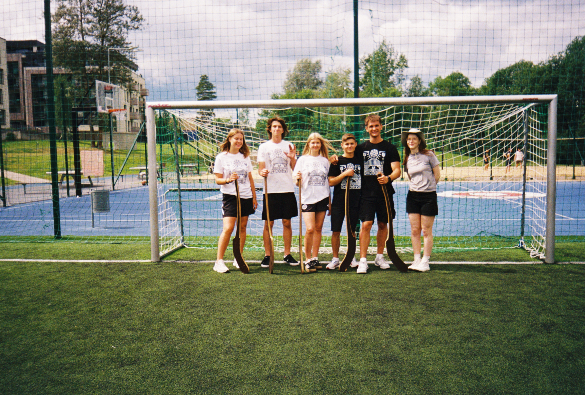 | `fill-11-2916e5290641.png` | 5.9 MB | **Team photo 6** — six people in front of goal (outdoor) |
|  | `fill-43-8e135aa9a847.png` | 240 KB | **Team lineup** — 8-10 people in formal line in front of goal |
| 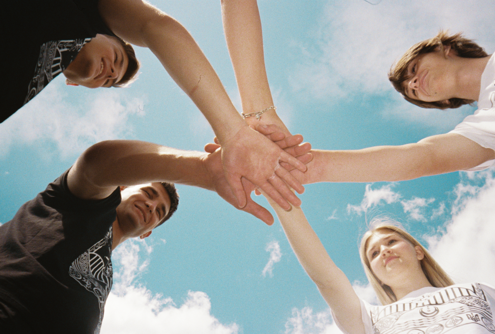 | `fill-8-255ddaba1842.png` | 5.8 MB | **Team huddle sky** — circle from below, hands raised, blue sky |
| 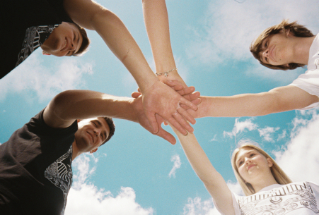 | `fill-49-ae00d9926070.png` | 190 KB | **Team huddle sky** — similar hands-up huddle shot |
| 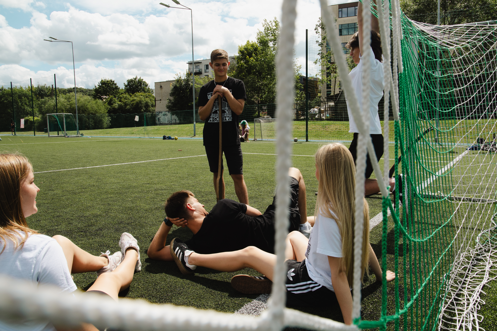 | `fill-15-3139c96759d5.png` | 12.4 MB | **Relaxed group** — players sitting/lying on grass by goal |
|  | `fill-54-c9cd2639bd73.png` | 287 KB | **Casual group** — young people sitting together near goal net |
| 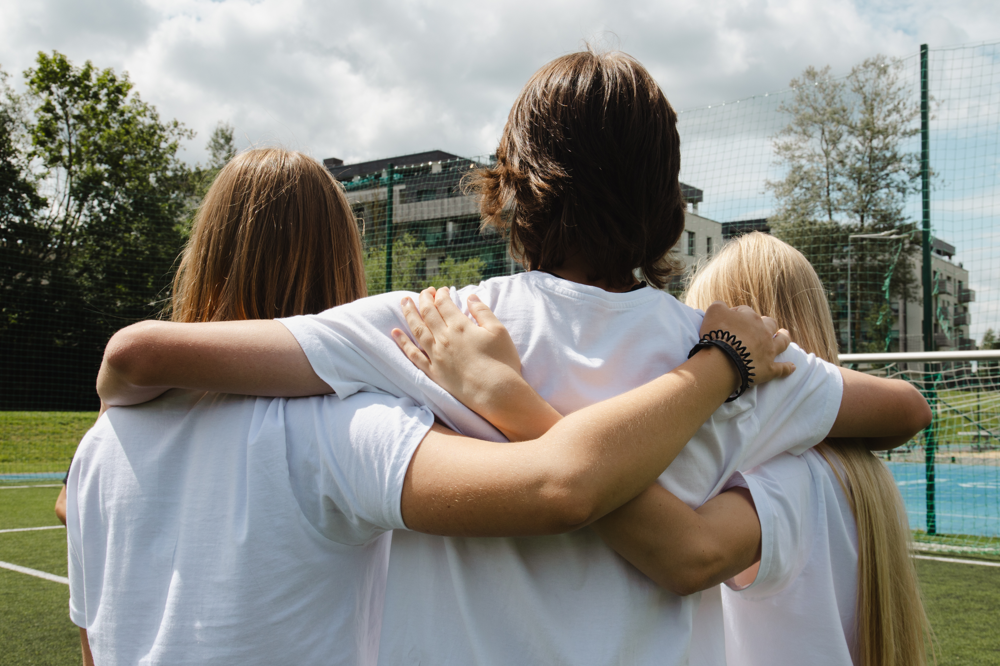 | `fill-35-6eeeccf1ad81.png` | 8.6 MB | **Teammates embracing** — two people hugging from behind on sports field |
|  | `fill-9-2594b835df6c.png` | 221 KB | **Pair hugging** — two players embracing from behind, sky background |
| 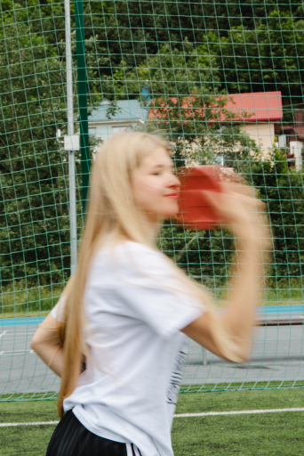 | `fill-48-ac7ad7b63b9e.png` | 261 KB | **Girl throwing** — girl in white shirt in motion, goal net |
| 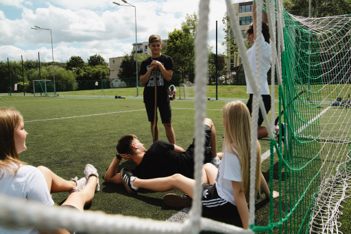 | `fill-72-ef05760f73f6.png` | 274 KB | **Group outdoor event** — players/people at outdoor sports event |
| 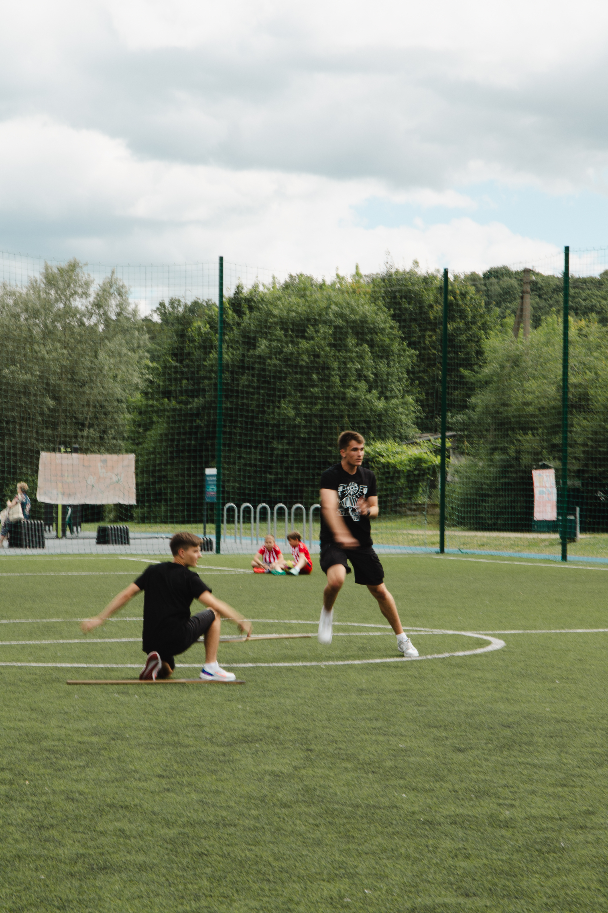 | `fill-24-4d93f8da3b7d.png` | 8.8 MB | **Player at dusk** — player in black on outdoor court, evening light |

---

## Photographs — VR / Technology (used in About Ripka page)

| Preview | File | Size | Description |
|---------|------|------|-------------|
|  | `fill-21-427943159ee6.png` | 5.7 MB | **VR headset boy** — teenager wearing Oculus VR headset, holding controllers |
| 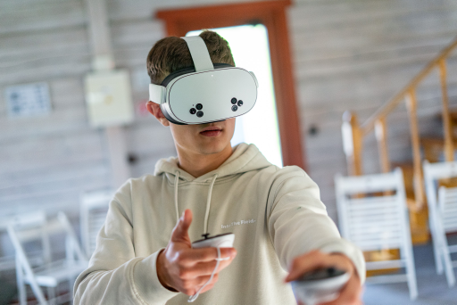 | `fill-25-4e568f44d271.png` | 291 KB | **VR headset** — same scene, cropped differently |

---

## Photographs — Miscellaneous

| Preview | File | Size | Description |
|---------|------|------|-------------|
| 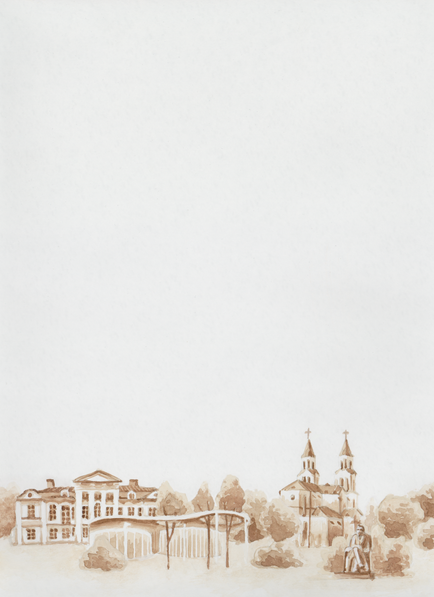 | `fill-19-37ae79cc5e39.png` | 9.7 MB | Near-white/overexposed photo (light background, abstract) |
|  | `fill-42-8bb2269ccc74.png` | 166 KB | Very light tan/white (cardboard texture or blank product background) |
| 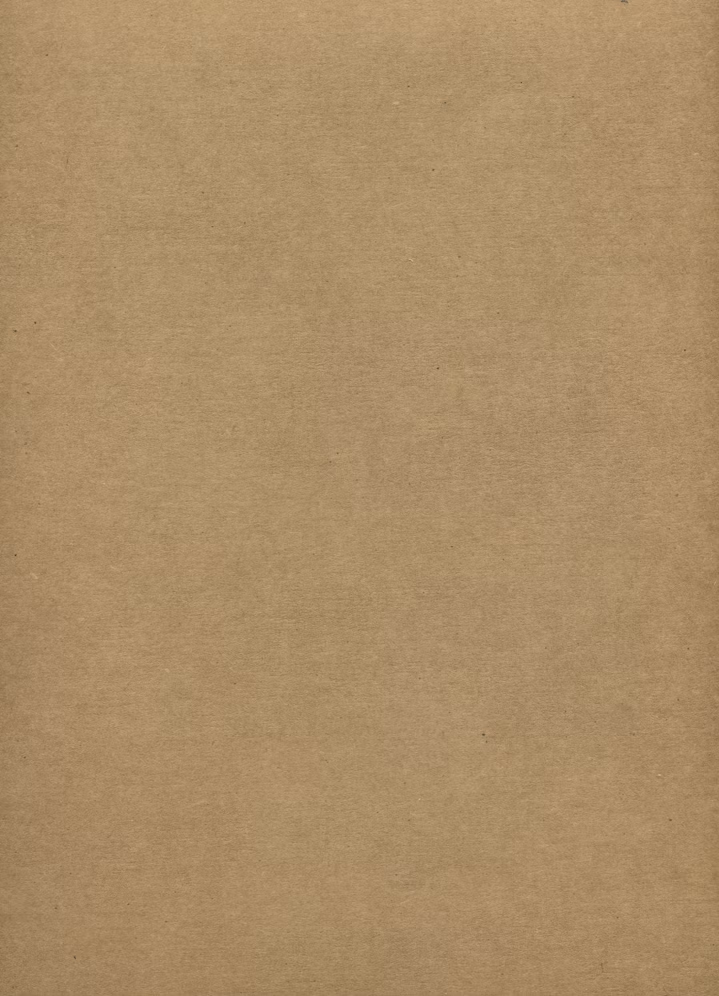 | `fill-47-a1e33c12802e.png` | 729 KB | **Cardboard/kraft paper texture** — warm tan surface texture |
| 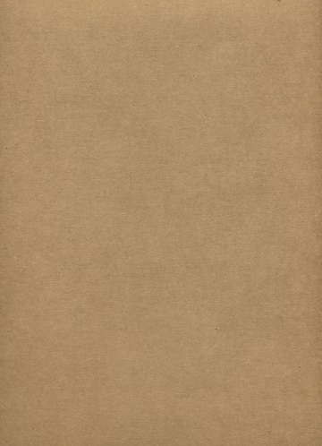 | `fill-29-621ba0b4c695.png` | 163 KB | **Cardboard texture** — same material, smaller version |

---

## Maps

Used in the Contacts page.

| Preview | File | Size | Description |
|---------|------|------|-------------|
| 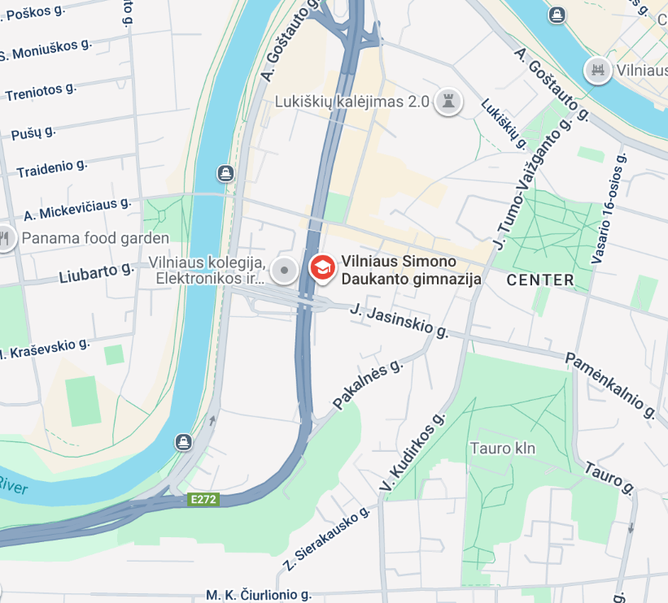 | `fill-60-da247803ab32.png` | 421 KB | **Vilnius map** — Google Maps screenshot, Vilnius Simono Daukanto Gimnazija area |
| 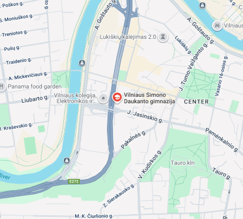 | `fill-76-f1fe16ac65c1.png` | 154 KB | **Vilnius map small** — same location, zoomed out slightly |

---

## Sponsor & Partner Logos

### Main Sponsors

| Preview | File | Size | Name |
|---------|------|------|------|
|  | `fill-44-94cee0b1aa79.png` | 14 KB | **DLG Logistics Group** — blue text logo |
|  | `fill-82-fef4b7e54990.png` | 52 KB | **DLG Logistics Group** — larger version |
| 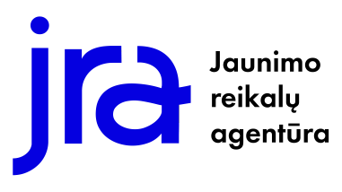 | `fill-30-65d46190961a.png` | 13 KB | **jra** — Jaunimo reikalų agentūra, blue logo |
| 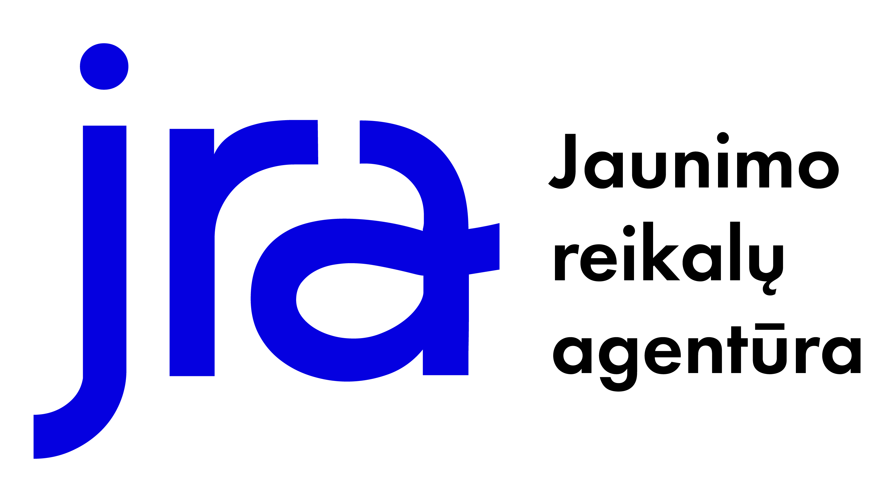 | `fill-69-e42b93ff6f44.png` | 173 KB | **jra** — Jaunimo reikalų agentūra, larger version |
| 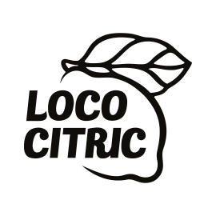 | `fill-59-d657eaeecf02.png` | 19 KB | **Loco Citric** — icon/crest only |
| 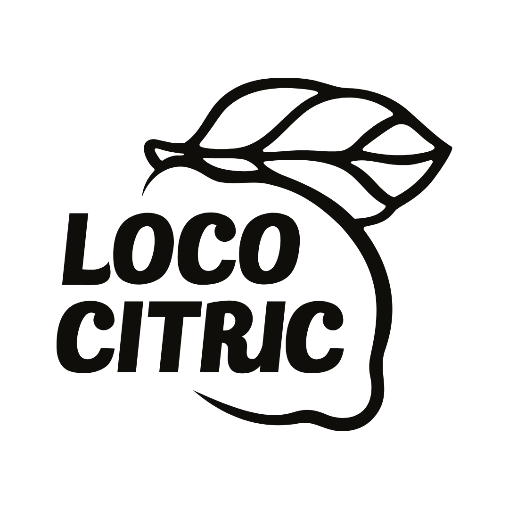 | `fill-66-e1aec830be9e.png` | 109 KB | **LOCO CITRIC** — full logo |
| 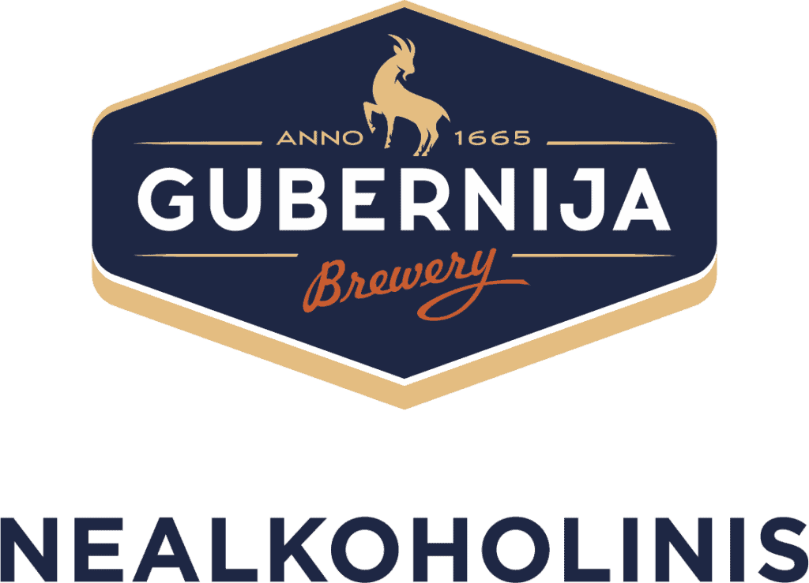 | `fill-56-cffecf90f350.png` | 63 KB | **Gubernija Brewery** — Nealkoholinis (non-alcoholic) sponsor |
| 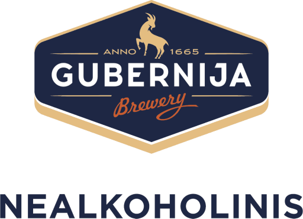 | `fill-65-e0163101719f.png` | 43 KB | **Gubernija Brewery** — alternate size |
| 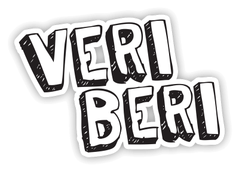 | `fill-46-9813d1fa4a40.png` | 69 KB | **VERI BERI** — graffiti-style logo |
| 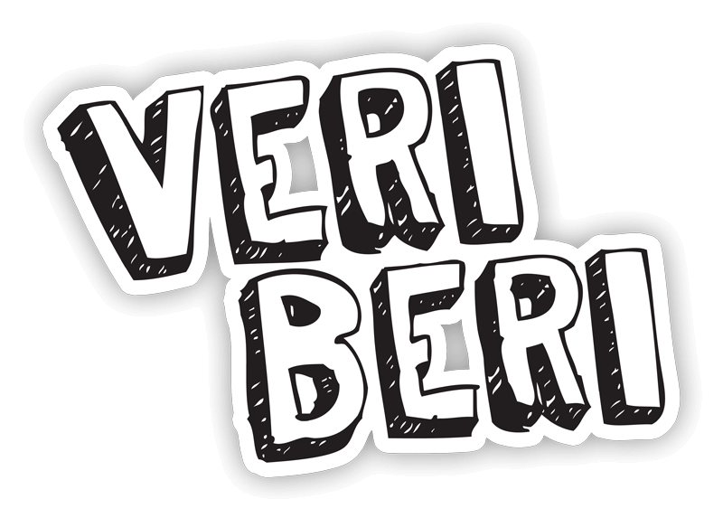 | `fill-81-fd45324495a8.png` | 126 KB | **VERI BERI** — larger version |
| 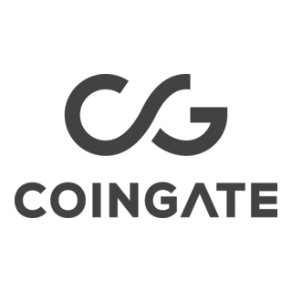 | `fill-12-2a72eee61e68.png` | 17 KB | **CoinGate** — CG symbol logo |

### Institutional Partners

| Preview | File | Size | Name |
|---------|------|------|------|
| 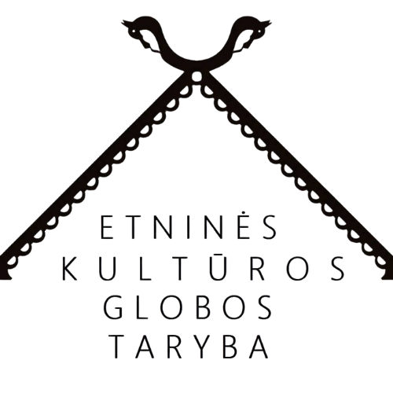 | `fill-10-283ab16ae636.png` | 102 KB | **Etninės Kultūros Globos Taryba** — National Ethnical Culture Council |
| 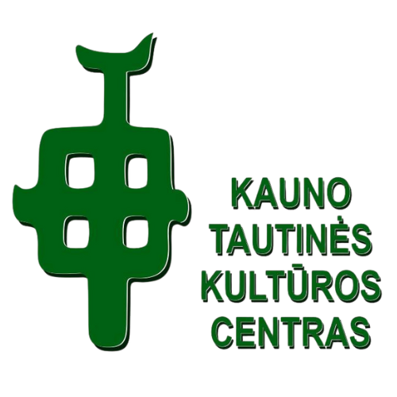 | `fill-53-c5345dbafdf8.png` | 142 KB | **Kauno Tautinės Kultūros Centras** — Kaunas National Culture Centre |
| 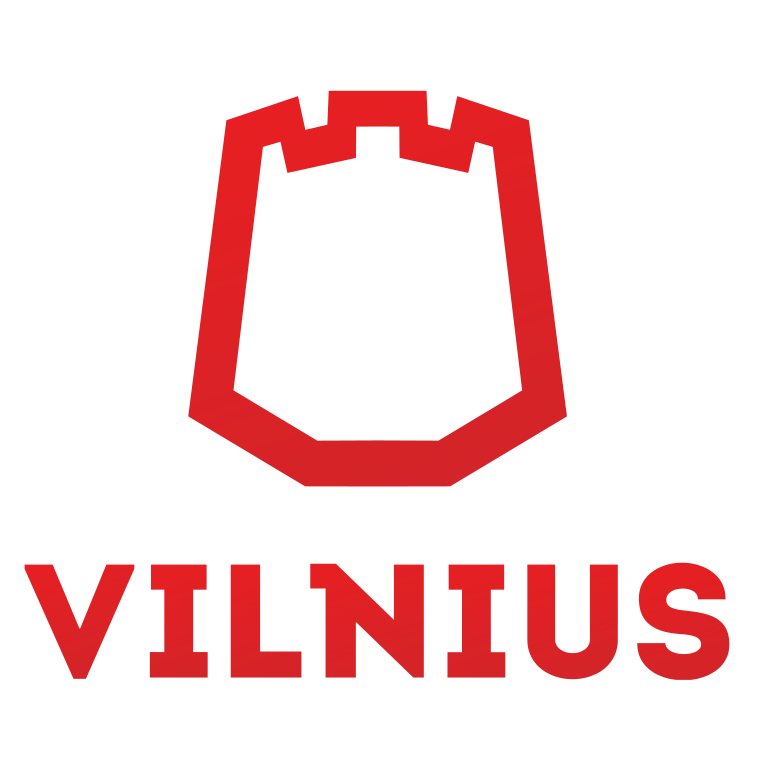 | `fill-5-0d02d56c5ff4.png` | 48 KB | **Vilnius city logo** — red castle + "VILNIUS" text |
| 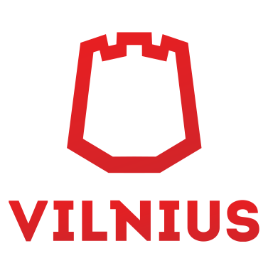 | `fill-40-86c2ee5617c6.png` | 25 KB | **Vilnius city logo** — alternate size |
| 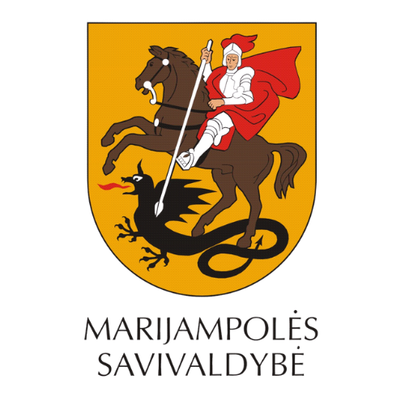 | `fill-13-2c26ed9c2509.png` | 235 KB | **Vytis** — Lithuanian knight crest (region/city emblem) |

---

## Team School Logos

Each team in the league represents a Vilnius school.

| Preview | File | Size | School |
|---------|------|------|--------|
| 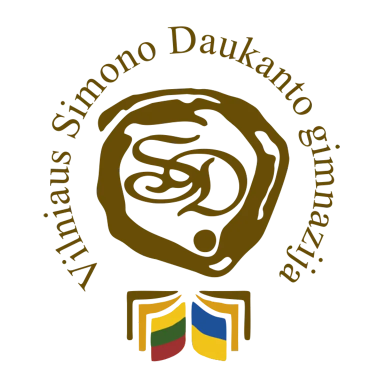 | `fill-4-0c2ce59a681e.png` | 82 KB | **Vilniaus Simono Daukanto Gimnazija** — gold circular crest |
| 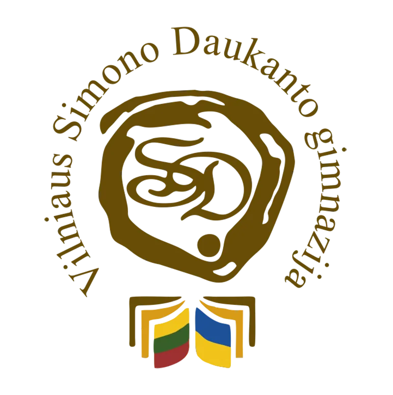 | `fill-68-e2b84c47fef1.png` | 223 KB | **Vilniaus Simono Daukanto Gimnazija** — larger version |
| 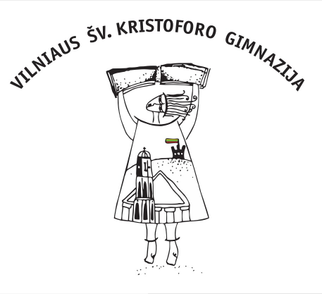 | `fill-28-5cc1867c0b1b.png` | 71 KB | **Vilniaus Šv. Kristoforo Gimnazija** — circular logo with figure |
|  | `fill-78-fc70333040f5.png` | 211 KB | **Vilniaus Šv. Kristoforo Gimnazija** — larger version |
| 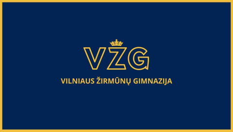 | `fill-50-afcb95bb3939.png` | 38 KB | **Vilniaus Žirmūnų Gimnazija (VŽG)** — navy/gold badge |
| 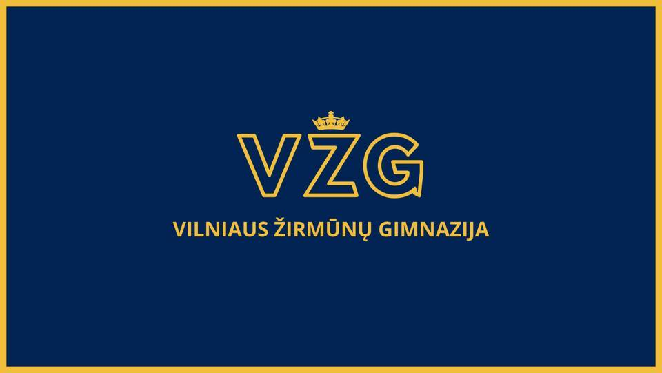 | `fill-73-ef4f38acf62f.png` | 125 KB | **Vilniaus Žirmūnų Gimnazija (VŽG)** — larger version |
|  | `fill-14-2f58aff4c3d8.png` | 7 KB | **Vilniaus Tuskulėnų Gimnazija** — maple leaf + Lithuanian tricolor |
| 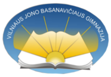 | `fill-51-b1709e66d56c.png` | 47 KB | **Vilniaus Jono Basanavičiaus Gimnazija** — yellow/blue sun emblem |

---

## Notes

- Frames 25–49 (320px mobile designs + remaining components) were not exported due to Figma API rate limits. Run `scripts/export-frames-resume.ps1` after a few hours to get them.
- The logos at `frame-40` (Etnolyga horizontal logo PNG) and `frame-41` (Etnolyga vertical logo PNG) are also pending — use the `ETN♦LYGA` text implementation in Navbar/Footer in the meantime.
- Many photos exist in multiple resolutions — prefer the largest version for hero sections and the smaller compressed version for cards/thumbnails.

